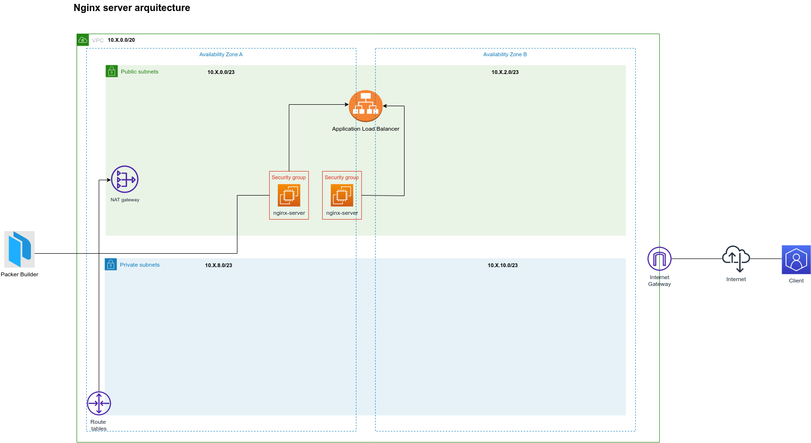

# Infrastructure test - documentation.
```
on this repository you can found all code relationated with infrastructure for a technical test
```

### Pre-requisites.

- [aws CLI](https://docs.aws.amazon.com/cli/latest/userguide/getting-started-install.html). 
- [Terraform v1.2.7](https://developer.hashicorp.com/terraform/tutorials/aws-get-started/install-cli).
- [Python 2.9.6](https://www.python.org/downloads/).
- [Packer 1.8.6](https://developer.hashicorp.com/packer/tutorials/docker-get-started/get-started-install-cli).


### Infrastructure diagram.




### 1.- Configure AWS AMI with packer.

before to create AMI with packer, import keys AWS account.
(we recommend use the  `us-east-1` region.)

    aws configure

make sure to have permisions to create resources like:

  - **amis.**
  - **ec2 instances resources.**
  - **load balancers resources.**

### 2.- Build a packer image.

Comprobe packer configuration and deploy AMI (don't forget to copy the `AMI ID` )

    packer validate packer/aws-ami.json 

    packer build packer/aws-ami.json 

### 3.- Configure your new AWS profile for terraform (`technical-test` is an example name, you can use the same).

    aws configure --profile technical-test

#### Watch profiles created.

    aws configure list-profiles

#### Example to use a profile.

    aws ec2 describe-instances --profile technical-test

### 4.- Configure AWS infrastructure with terraform.

before to create your aws account, youn need to refil your `infrastructure/variables.tf` file for
make work the tf resources, you have an example on `values.example` file.

#### Create infrastructure.

    cd infrastructure

    terraform init

    terraform plan

    terraform apply

then copy the output called `dns_alb_value` and enjoy!

### 5.- Delete infrastructure created.

    terraform destroy


#### Delete packer AMI.

for delete this resource, you need to open the aws console and search `AMIs Owned by me` and deleted 
the resource with the same AMI ID that the created by packer.


### 6.- improvements

    - Attach a DNS Record
    - Attach a SSL certificate for more security.
    - Modularize the AWS resources that no have a module.
    - Be more explicit on the documentation description.
    - Close the ports for make more safety.
